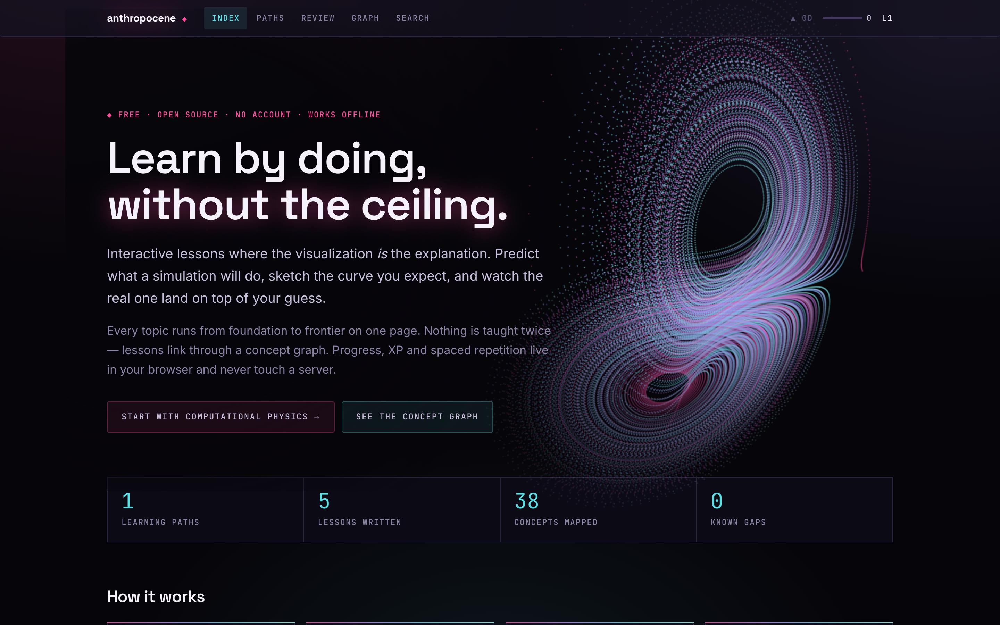

# anthropocene



A free, open-source, deeply interactive learning platform. Learn by doing — without the
ceiling.

Brilliant proved that short interactive problems beat reading. It also charges a lot and
stops well short of the material a practitioner actually needs. This keeps the
interaction model and removes the ceiling: every topic runs from foundation to frontier
on one page, and you choose the depth.

**Live:** https://entangledquantum.github.io/anthropocene/

## What makes it different

- **Predict → run → confront.** You commit to an answer *before* the simulation runs.
  Watching your prediction fail is the mechanism; a paragraph cannot do it.
- **Nothing asks you to write code.** Nobody hand-writes a solver in 2026, so testing
  that tests the part of the skill that is now free. Instead you **sketch the curve** you
  expect and watch the real one land on your guess, rank methods by cost, or sort a
  symptom into cause — the judgement a model will not exercise for you.
- **Visualizations that could not be a static figure.** Stability regions evaluated per
  pixel on the GPU that you drag a point around; phase-space area transport that makes
  Liouville's theorem something you watch rather than accept.
- **One concept, one owner.** A concept is taught by exactly one lesson, enforced at build
  time. Everything else links to it — so the material never repeats itself, and the list
  of unwritten topics is generated rather than maintained.
- **Foundation to frontier in one lesson.** `<Tier>` blocks fold away the depth until you
  ask for it.
- **Recall built in.** Cards are authored inline where the idea appears and scheduled with
  FSRS-6.
- **Yours, locally.** XP, streaks and review state live in SQLite in your browser. No
  account, no server, no subscription, works offline.

## Stack

| | |
|---|---|
| Framework | Astro 7 + React islands — 0 JS on prose, hydration per widget |
| Math | KaTeX rendered at **build time** via Satteri's native math support |
| Plots | Canvas data layer + SVG axes on `d3-scale` / `d3-shape` |
| GPU visuals | Raw WebGL2 fragment shaders (`src/components/viz/gl/`) — stability regions, phase fields, the landing-page Lorenz attractor |
| Storage | SQLite-WASM (`opfs-sahpool` VFS — no COOP/COEP, so it works on GitHub Pages) |
| Recall | `ts-fsrs` (FSRS-6) |
| Search | Pagefind — chunked index, downloads only what a query needs |
| Python | Pyodide, lazy, opt-in per lesson |

## Run it

```bash
npm install
npm run dev          # http://localhost:4321/anthropocene
```

```bash
npm run content:check   # concept-graph rules, gaps, per-lesson requirements
npm run content:gaps    # the generated to-write queue
npm test                # asserts the physics: orders, stability, energy drift, area preservation
npm run build           # runs content:check first
npm run screenshot      # regenerate docs/landing.png after frontend changes
```

## Adding content

Read **[AGENTS.md](AGENTS.md)**. It is the formula — the no-code-writing rule, the bar a
visualization has to clear, the widget vocabulary, and the architectural constraints that
will otherwise cost you an hour each.

**[LEARNING-PLAN.md](LEARNING-PLAN.md)** is the queue: what to write next, in order,
basic → advanced. Ship a lesson, delete its entry in the same commit.

```bash
npm run new:lesson -- --path computational-physics --chapter 03-ode-solvers \
  --id 05-dormand-prince --title "Adaptive steps in practice" \
  --teaches embedded-pairs --requires rk4,butcher-tableau
```

If the path does not exist, it is created. Give it a category and it builds the learning
path around it.

## Content

`content/` is fully separate from `src/`. Nothing in it imports app code and nothing in
`src/` hardcodes a lesson.

The first path is **Computational Physics**: floating point → finite differences → ODE
solvers one at a time → structure-preserving integrators → spectral, variational, Monte
Carlo and differentiable simulation.

## Licence

MIT for the code. Content under [CC BY-SA 4.0](https://creativecommons.org/licenses/by-sa/4.0/).
